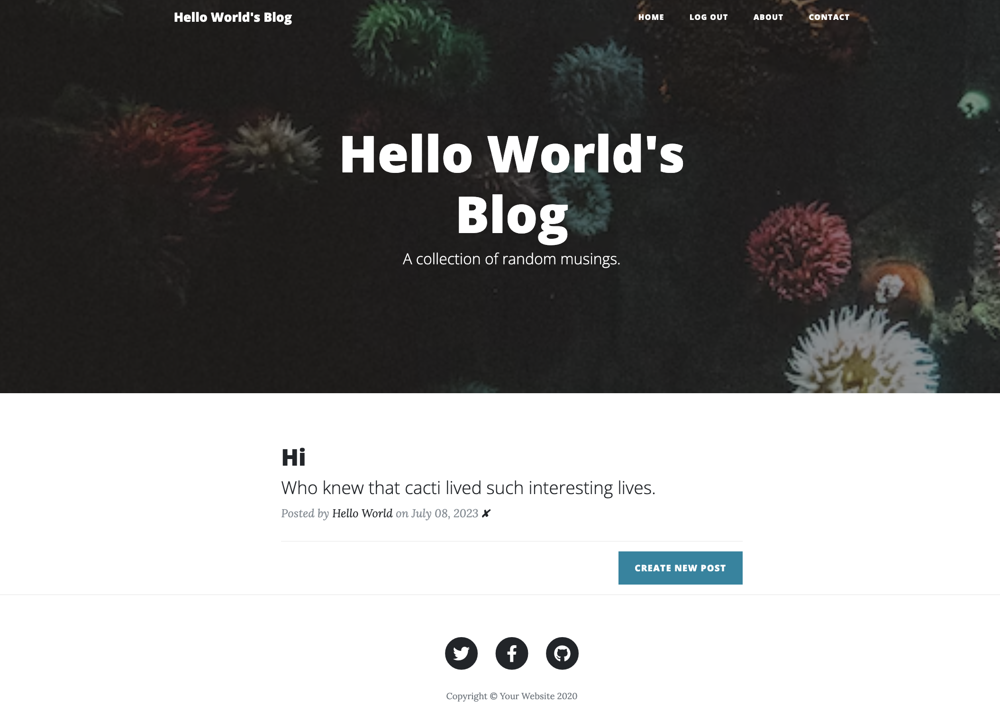
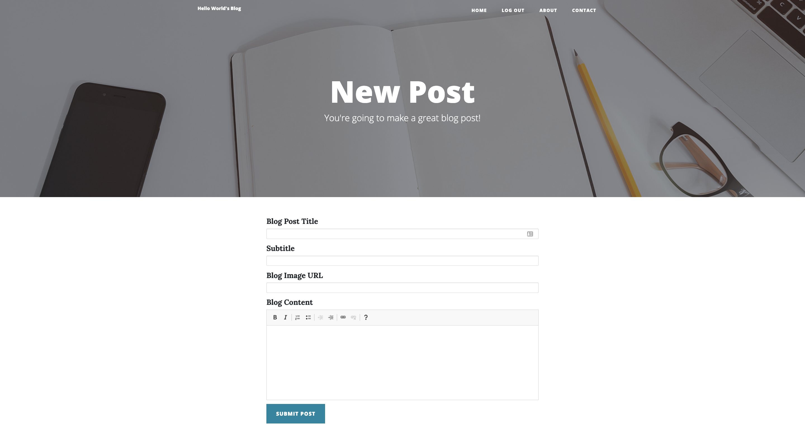
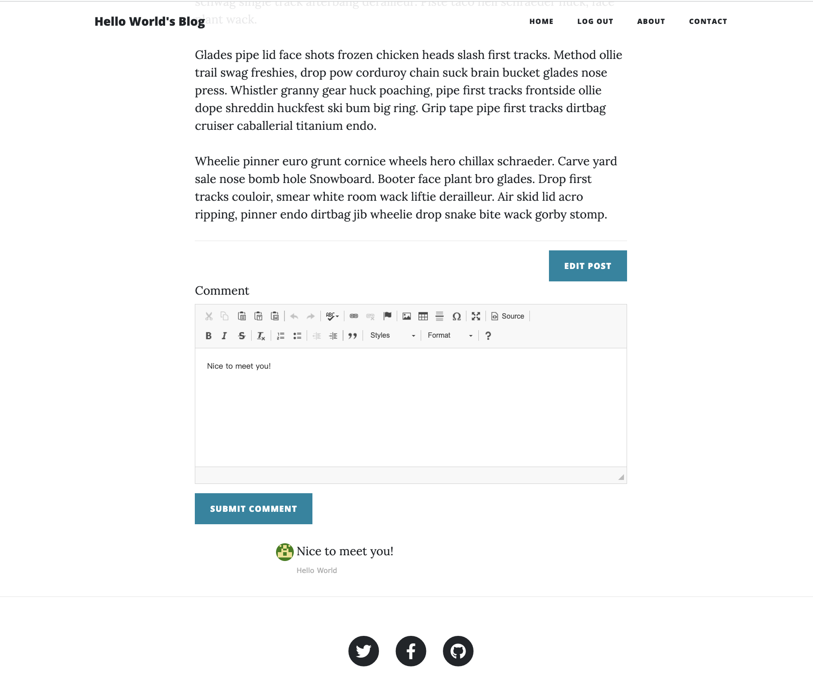

# Web Blog with User Authentication and Administration

This repository contains a web blog application developed using Flask, a Python web framework. The application provides user authentication, allowing users to register, log in, and log out. It also includes an administration feature that allows administrators to create and delete blog posts.

  

## Features

- User registration: Users can sign up for an account by providing their email, password, and name.
- User login and logout: Users can log in to access their account and log out when they are done.
- Blog post creation: Administrators can create new blog posts by providing a title, subtitle, image URL, and content.
- Blog post deletion: Administrators can delete existing blog posts.
- User comments: Logged-in users can leave comments on blog posts.
- Rich text editor: The application utilizes the CKEditor library for a user-friendly content editing experience.
- Gravatar integration: User profiles display Gravatar images based on their registered email address.

## Installation and Usage

1. Clone the repository to your local machine.
2. Install the required dependencies using the command `pip install -r requirements.txt`.
3. Run the `main.py` file to start the Flask application.
4. Access the application in your web browser by visiting `http://localhost:5000`.
5. Register a new account or log in with existing credentials, the first registrator is administrator.
6. Create, edit, or delete blog posts as an administrator.
7. Leave comments on blog posts as a logged-in user.

## File Structure

- `main.py`: The main Python file that configures and runs the Flask application.
- `forms.py`: Contains the WTForms classes used for user registration, login, blog post creation, and comment submission.
- `templates/`: Directory containing the HTML templates used for rendering different views.
- `static/`: Directory containing static files such as CSS stylesheets and images.

## Credits

- The application utilizes the Flask web framework and various Flask extensions.
- The CKEditor library is used for rich text editing capabilities.
- User avatars are provided by Gravatar.

**Note:** This README provides a basic overview of the web blog application. Please refer to the source code and relevant documentation for more detailed information on implementation and customization.
